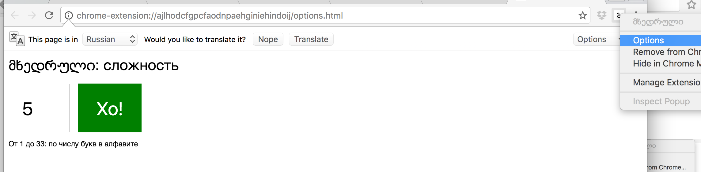
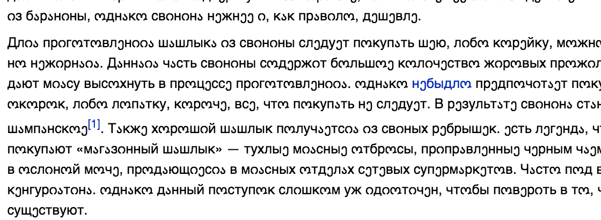
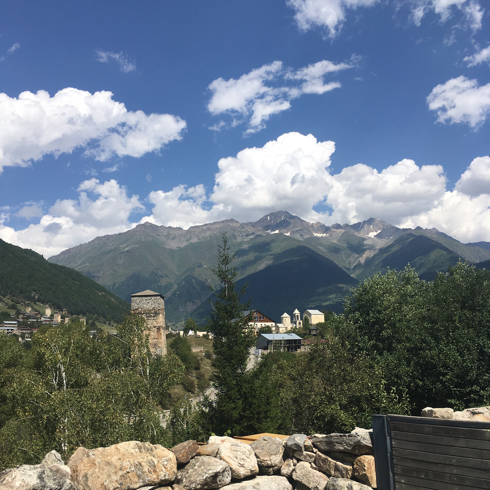

# მხედრული

Учим грузинский алфавит.

Устанавливаем сложность (правой кнопкой на иконке):

Жмем иконку "გ" на желаемой странице:

Учим!

Автор: Виктор Соколов <gzigzigzeo@evilmartians.com>
Иконка: Роман Шамин <roma@evilmartians.com>

